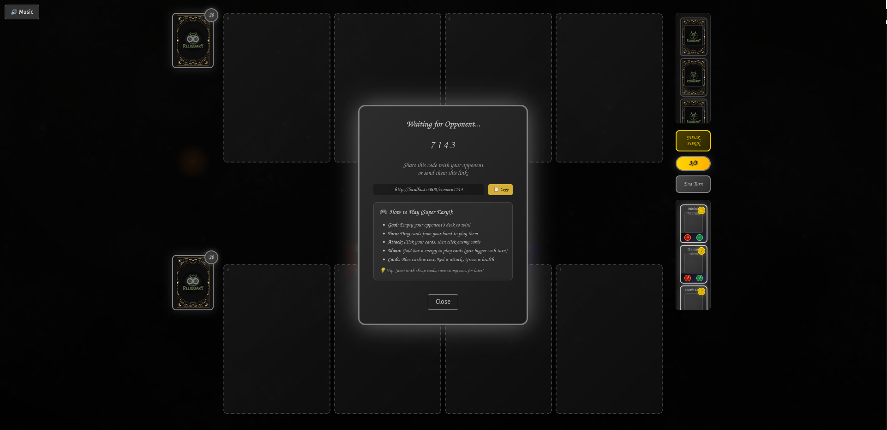
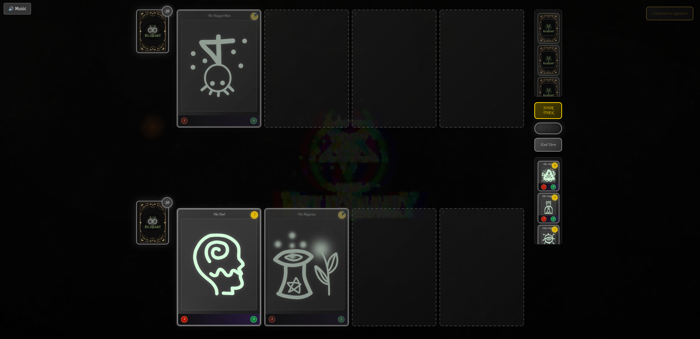

# TheReliquary

tactical strategy card game. minimalist eldritch theme. browser-based multiplayer.

## what is this

move cards around on a grid. try to win. has spooky cosmic horror vibes but not overdone.




## how to run

```bash
npm install
npm start
```

open localhost:3000 in two tabs. one gets a room code, other joins with it. play.

## structure

```
client/     # frontend stuff
server/     # backend stuff  
assets/     # images and sounds
```

- vanilla js, no frameworks
- websockets for multiplayer
- cards are in cards.json

## the game

- place cards on battlefield grid
- cards have cost, attack, health
- win by controlling zones or killing enemy commander
- turn based, no rng nonsense

that's it. it works.

## Known Bugs Version 1.0

Music Mute button auto unmuted on Game Interaction.

## contributing

sure, submit a PR. keep it simple.
